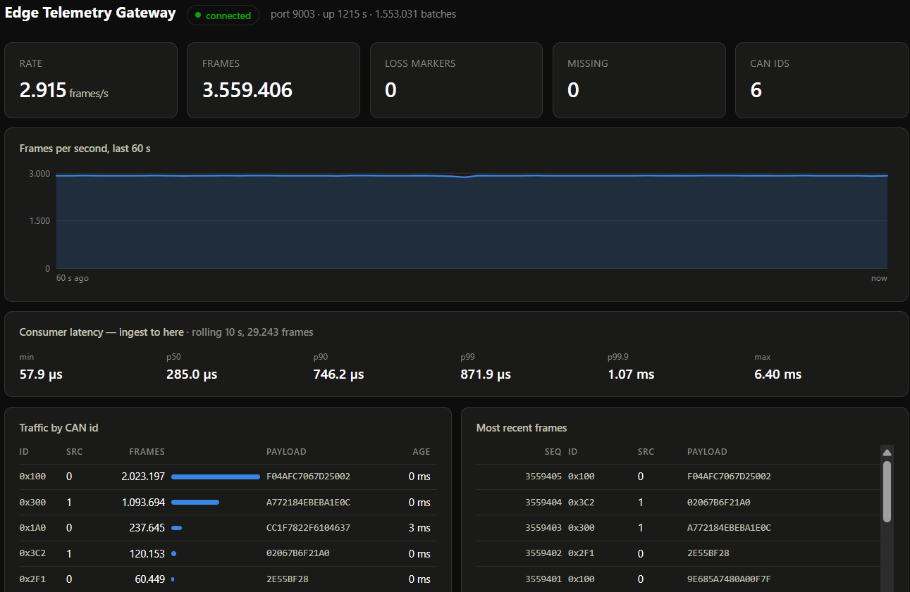
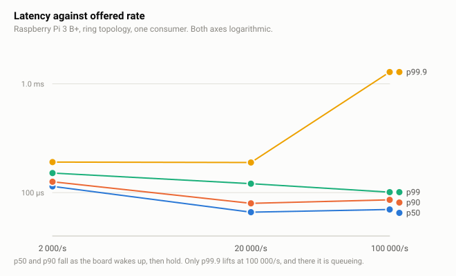
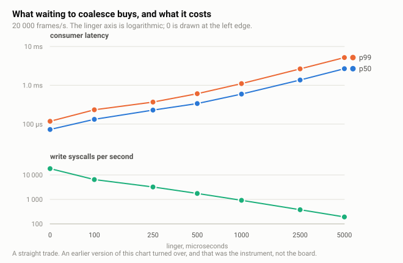
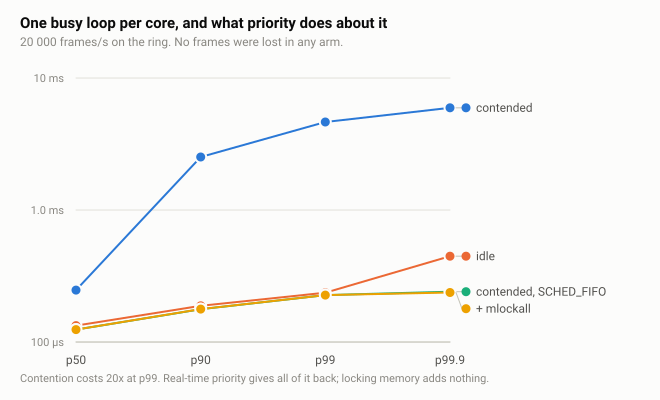
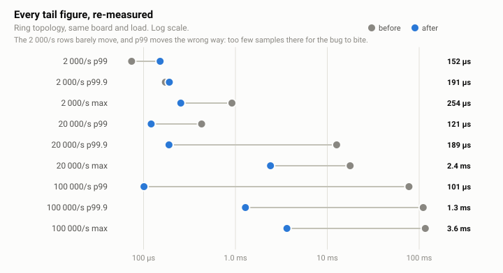

# Edge Telemetry Gateway

A multi-threaded C++20 service that ingests CAN frames from one or more field
buses, stamps and sequences them, and fans them out to independent consumers
running as separate containers.

Where a supervisor daemon answers *what happens when a process dies*, this
answers **what happens when a consumer cannot keep up, when the producer outruns
the pipeline, and when a consumer disappears and comes back**.

```
vcan0 ─┐                              ┌─► [egress] ──► TCP ──► probe
vcan1 ─┼─► [ingest] ─► [ring or queue] ┼─► [egress] ──► TCP ──► recorder
vcan2 ─┤    assign seq                 ├─► [egress] ──► TCP ──► live view
LIN ───┘                               └─► [egress] ──► TCP ──► cadence monitor
```

## Status

**M1-M5 complete.** The pipeline runs end to end, in containers, under CI, with
ThreadSanitizer, against a real SocketCAN interface, and every claim it makes
about latency, loss, back-pressure and recovery is measured on a Raspberry Pi
3 B+ from committed scripts.

| Milestone | State |
|---|---|
| M1 — working pipeline, per-consumer mutex queues (topology A) | done |
| M2 — lock-free broadcast ring (topology B) | done |
| M3 — gap markers, cadence monitor | done |
| M4 — measurement on the Pi | done |
| M5 — cross-machine round-trip latency, scheduling, thermal, recovery | done |

## Try it

Nothing but Docker is required; the default source is synthetic, so no CAN
hardware and no `vcan` are needed:

```sh
docker compose up
```

Then open **<http://localhost:8080/>** for the live view: rate over the last
minute, per-CAN-id traffic, sequence gaps, and the most recent frames.



Above is a twenty-minute run on the Raspberry Pi 3 B+: two `vcan` interfaces
driven by `cangen` at six different periods, 3.56 million frames delivered to
three consumers with no loss markers and nothing missing. The `src` column is
the part worth looking at — ids from bus 0 and bus 1 interleaved under one
unbroken sequence, which is the whole reason the ring accepts several producers.

Latency appears at all only because the gateway and the view were on the same
machine there. Point the view at a gateway across the network and the card
refuses to plot, because subtracting two machines' `CLOCK_MONOTONIC` readings
returns the difference in their uptimes rather than a delay — measured between
this Pi and its development machine, minus 3383 seconds. The cross-machine
figure comes from round-trip probes instead; see [results/](results/).

The view is worth one sentence of explanation, because *how* it observes is the
point. It is a consumer like any other — it connects to a gateway port and
decodes the documented protocol. There is no debug hook and no side channel, so
it only sees what a consumer can see. Queue depth, `would_block` and per-consumer
drop counts live in the gateway and are printed there, because no consumer is
told about them.

That default path runs on a bridge network and works on Docker Desktop
(Windows, macOS) as well as on Linux.

Against a real SocketCAN interface — **Linux hosts only**:

```sh
sudo ./scripts/setup-vcan.sh 1
ETG_SOURCE=can:vcan0 docker compose   -f docker-compose.yml -f docker-compose.vcan.yml --profile vcan up
```

`vcan` is a host kernel module whose interface lives in the host's network
namespace, so those containers must share that namespace. On Docker Desktop
"the host" is the Linux VM rather than the machine you are sitting at, and that
VM's kernel has no `vcan` — which is exactly why the default path does not use
host networking.

Building natively:

```sh
cmake -S . -B build -G Ninja
cmake --build build
ctest --test-dir build --output-on-failure
```

## What it does

**Ingest.** A source is a file descriptor plus a batch drain. A CAN raw socket,
the `hidraw` node of a LIN adapter, and a `timerfd`-driven synthetic generator
are all genuinely file descriptors, so the threading topology can change without
touching any source. `CanSource` reads with `recvmmsg` and enables
`SO_TIMESTAMPING` for the kernel receive timestamp and `SO_RXQ_OVFL` so frames
the kernel dropped before we saw them are counted separately from our own.

**Ordering.** The ingest thread assigns the global sequence number, because a
single bus cannot know the order across buses. The guarantee is precise:
*per-source FIFO, with an arbitrary interleaving across sources.*

**Back-pressure.** Writes are non-blocking. A consumer that falls behind fills
its socket buffer, `send` returns `EWOULDBLOCK`, the egress thread parks on
`POLLOUT`, and that consumer's queue overflows and drops — in that order, and
without touching any other consumer. `push` never blocks: a producer that waited
for space would let one slow consumer stall the entire pipeline.

**Loss.** At-most-once, drop-oldest. Every frame offered is accounted for:
`pushed == popped + dropped + size`. Loss is *reported*, not inferred: the
gateway sends a marker naming the first sequence a consumer did not receive and
how many are missing, because only the gateway can say why they went. A consumer
also counts sequence jumps that arrive with no marker — under wire version 2
that must never happen, so it is the check that the mechanism works rather than
a fallback.

**Why that matters, measured.** The cadence monitor flags a CAN id that stops
arriving on time, which is unavoidably a measurement of inter-arrival time — so
loss it does not know about looks exactly like a bus going quiet. Two monitors on
the same stream at 20k frames/s, one ignoring the markers:

| | anomalies |
|---|---|
| gap-aware | 6 |
| gap-blind (control) | 64 |

Fifty-eight alarms about equipment that was working perfectly. That is what the
sequence numbers and the version-2 markers buy.

**Protocol.** A documented little-endian binary format
([docs/wire-format.md](docs/wire-format.md)), parsed field by field. The receive
buffer is never cast to a struct, even though the layouts match today. To keep
that claim honest, [`scripts/parse-capture.py`](scripts/parse-capture.py)
implements the format in another language from the specification alone, and CI
runs it against every capture.

## Measured on the Raspberry Pi

Full method, limitations and raw logs in [results/](results/). Every chart below
is drawn by `./scripts/plot.py` from the committed `summary.txt` files, so none
of these numbers is typed in twice and re-measuring redraws them.

### Latency against offered rate

<picture>
  <source media="(prefers-color-scheme: dark)" srcset="docs/images/latency-vs-rate-dark.svg">
  
</picture>

Four 500 kbit/s CAN buses produce on the order of 16 000 frames/s, so the middle
point is already past the load this was built for. The rise from left to middle
is the `ondemand` governor: a nearly idle board drops its clock and sleeps its
cores, and every wake-up pays to come back.

### What batching buys, and what it costs

<picture>
  <source media="(prefers-color-scheme: dark)" srcset="docs/images/batching-dark.svg">
  
</picture>

Two panels rather than two y-axes on one frame, because the whole question is
the size of the trade and a second scale is how that gets misrepresented.

### Scheduling policy under contention

<picture>
  <source media="(prefers-color-scheme: dark)" srcset="docs/images/scheduling-dark.svg">
  
</picture>

One busy loop per core against the pipeline. `SCHED_FIFO` returns the whole
distribution, including the tail; `mlockall` on top of it adds nothing
measurable, because this pipeline allocates its ring once and then reuses it.

### The measurement bug this project found in itself

<picture>
  <source media="(prefers-color-scheme: dark)" srcset="docs/images/correction-dark.svg">
  
</picture>

The probe sorted its own growing sample buffer once a second, inside the read
loop it was measuring. The stall grew with run length and landed in the tail it
was reporting. Two published conclusions rested on those numbers and both were
wrong; [results/](results/) names them as retracted rather than quietly
restating them.

## Measurements so far

From a GitHub Actions runner (x86_64, shared, no CPU pinning), 2000 frames/s
over `vcan0`, one generator and two consumers. These validate the plumbing;
**they are not the project's performance numbers.** Those come in M4, on a
Raspberry Pi 3 B+, with a stated method and stated limitations.

| | p50 | p99 | max |
|---|---|---|---|
| generator pacing error | 14.4 µs | 18.9 µs | 68.0 µs |
| gateway latency (ingest → consumer) | 45.3 µs | 68.2 µs | 331.9 µs |
| end-to-end (generator → consumer) | 66.3 µs | 91.0 µs | 858.8 µs |

A shared runner gives a different median every run, so read the shape rather
than the digits. The maxima are the part that moved for a reason: they were
1.05 ms, 1.21 ms and 1.22 ms until the consumer stopped sorting its own sample
buffer inside the loop it was measuring — see the correction at the top of
[results/](results/).

The generator reports its own pacing error against an absolute schedule, because
a load generator that cannot prove its output was flat makes every latency
number downstream of it unfalsifiable.

Two lessons already paid for:

- **Warm-up matters.** A consumer connecting to a running gateway finds a
  backlog, and those frames were queued before it existed. Measured without
  excluding it, p99 was 345 ms — which is exactly `queue_depth / rate`, a
  property of the buffer rather than of the system. Excluding two seconds moved
  p99 to 120 µs while p50 stayed at ~44 µs.
- **A green sanitizer run proves nothing on its own.** Making one counter a
  plain `uint64_t` produces a TSan report naming both lines — while the test
  still passes all 307,364 of its assertions. Only TSan sees it.

## Layout

```
src/        gateway, generator, probe, recorder, live view, and the shared core
docs/       wire-format.md — normative protocol specification
scripts/    vcan setup, smoke tests, independent capture parser
tests/      unit, concurrency and socket tests
SCOPE.md    locked decisions with reasons, non-goals, milestones, risks
```

## Limitations, stated

- `vcan` has no bit timing, no arbitration, no bus-off. Overload scenarios are
  synthetic and do not correspond to a 500 kbit/s bus.
- Classic CAN only; an 8-byte payload keeps the record at 40 bytes and one ring
  cell per cache line. CAN FD is a version bump, which is what the wire version
  byte is for.
- Latency figures subtract two `CLOCK_MONOTONIC` readings and are therefore
  valid only within one machine. Cross-machine measurement uses `chrony` and is
  reported separately, in M4.
- The containers share the host network namespace, because `vcan` lives in the
  host's. Separate processes over real sockets, but not yet a boundary between
  machines.
- The live view's latency panel is a rolling ten-second window, for watching
  rather than for publishing. Numbers to quote come from `etg-probe --warmup`,
  which excludes the backlog a consumer inherits on connect.
